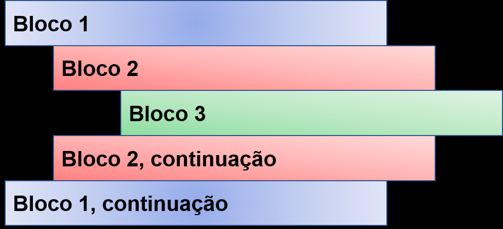

# Comandos condicionais -  Blocos

Um bloco é um conjunto de comandos agrupados

Os programas Python são estruturados através de indentação, ou seja, os blocos são definidos pelo seu espaçamento tabs em relação ao início da linha

**OBS: Em python a identação é obrigatória!**

### Exemplo sem indentação (Incorreta ❌):

~~~python
if (condicao):
#Executa código
elif (outra_condicao):
#Executa código
else: 
#Executa código
~~~

### Exemplo com indentação (Correto ✔):

~~~python
if (condicao):
    #Executa código
elif (outra_condicao):
    #Executa código
else: 
    #Executa código 
~~~