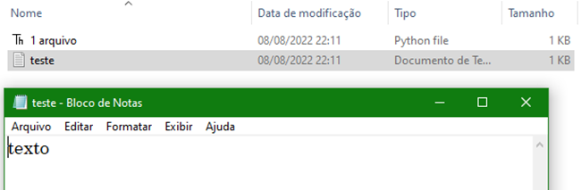

# Arquivos

## O que é? 📚
- Arquivo nada mais é do que uma área em um disco que guarda informações de forma organizada e que é gerenciada pelo nosso Sistema Operacional.

## Quando usar? 💭
- Quando queremos guardar dados de forma permanente.

- Guardar dados em arquivos, faz que que esses dados fiquem disponíveis para a aplicação sempre que ela for iniciada, ou até mesmo, para ser acessado por outras aplicações. 

 

# Trabalhando com arquivos – open() write() close()

## Abrir arquivo
- Para acessar um arquivo em Python utilizamos a função open()

- Essa função “abre” o arquivo para o uso.

- Nela definimos o local do arquivo (ou nome) e qual será o modo de uso (leitura ou gravação).

## Vamos abrir um arquivo “teste.txt”? 
Como o arquivo não existe, ele será criado no diretório em que se encontra o código fonte

~~~python
arq = open("teste.txt", "w")    #variavel recebe os dados criados no arquivos
arq.write("texto\n")            #Função Write escreve um texto no arquivo

arq.close()                     #Função close fecha o arquivo
~~~

Resultado:

 

Perceba que na função **open()**, temos um caractere. Abaixo tem uma tabela que explica o que queremos fazer dentro do arquivo. Como no exemplo queremos adicionar um texto, utilizamos o caractere "w" de escrita.

 

# Arquivos – read()

O método read() é utilizado para ler os dados de um arquivo.

~~~python
arq = open("teste.txt", "r") #variavel recebe os dados criados no arquivos (r= LEITURA)
texto = arq.read()           #Faz a leitura do arquivo
arq.close()                  #Função close fecha o arquivo

print(texto)

#texto
~~~

Pode receber como parâmetro o número de caracteres que deseja ser lido.

~~~python
arq = open("teste.txt", "r") #variavel recebe os dados criados no arquivos (r= LEITURA)
texto = arq.read(4)          #Faz a leitura do arquivo porém apenas de 4 caracteres
arq.close()                  #Função close fecha o arquivo

print(texto)

#text
~~~

 

# Arquivos – readlines()

Retorna uma lista com todas as linhas do nosso arquivo.

~~~python
arq = open("teste.txt", "w")
arq.write("Nova Linha\n")
arq.write("Nova Linha\n")
arq.close()

arq = open("teste.txt", "r")
texto = arq.readlines()
arq.close()

print(texto)

#['Nova Linha\n', 'Nova Linha\n']
~~~

Porém, veja que a lista imprime "\n", o que deixa esquisito, não acha?

Para resolver, podemos usar a função strip() vista na aula 3(função que retira os caracteres especiais)

~~~python
arq = open("teste.txt", "w")
arq.write("Nova Linha\n")
arq.write("Nova Linha\n")
arq.close()

arq = open("teste.txt", "r")
texto = arq.readlines()

for linha in arq.readlines():
    print(linha.strip())
    
arq.close()

#Nova Linha
#Nova Linha
~~~

