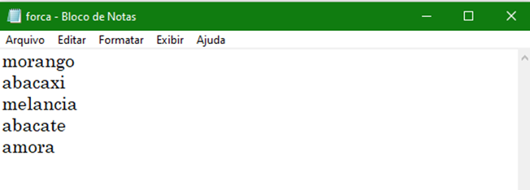

# Jogo da forca
Esta na hora de colocar em prática conhecimento obtido nas aulas anteriores!

Vamos criar o jogo da forca, um jogo que segue uma lógica simples mas que aborda vários conteúdos que estudamos até agora

Eai, está pronto??

 

# 1° Passo 📝

Criar uma lista com as palavras que serão usadas para adivinhação em um bloco de notas.

- Abaixo segue um exemplo. Use sua criatividade e crie uma lista diferente! 😉

 

# 2° passo 📝
Fazer o programa escolher aleatoriamente uma das palavras da lista.

- Para isso, podemos importar o módulo random, onde existe a função choice()

- Esta função recebe uma lista como argumento e retorna um elemento da lista, escolhido aleatoriamente.

- Mas antes não podemos esquecer de abrir nosso arquivo com a lista de palavras.

~~~python
from random import choice

#Parte1: ler o arquivo com as palavras
arq = open("forca.txt", "r")  #Abre arquivo txt para leitura "r"
palavras = arq.readlines()    #Faz a leitura das linhas
arq.close()                   #Fecha arquivo

#Parte2: escolher palavras aleatórias
escolha = choice(palavras)    #Função choice escolhe uma palavra aleatória
palavra = escolha.strip()     #Função strip tira qualquer caractere especial

print(palavra)  #O print mostra qual palavra foi escolhida (pode apagar depois)
~~~

Mais informações do módulo random:
https://docs.python.org/3/library/random.html 

 

# 3° passo:
Criar as linhas que compõem a palavra que deverá ser adivinhada.

~~~python
for letra in palavra:
    print("_", end= ' ')
~~~

- Desse modo, pra cada letra da palavra, um traço será impresso na tela.

- O parâmetro **end = ' '** serve pra dizer que o print deve ser encerrado com um caractere de espaço em branco, senão teríamos uma linha sem espaços “\______” ao invés de linhas separadas “_ _ _ _”.

 

# 4° passo:
Criar lógicas que abrangem as 4 possiblidades de palpite do jogador. 

- Depois que o programa escolhe uma palavra e desenha os traços referentes a cada letra, o jogador deve fazer seu palpite. O que poderia acontecer a partir desse ponto??

    - O jogador escolhe uma letra que ainda não foi escolhida e acerta o palpite. 😎

    - O jogador escolhe uma letra que ainda não foi escolhida e erra o palpite.😥

    - O jogador escolhe uma letra que já foi escolhida. 🙄

    - O jogador escreve alguma maluquice que não é uma letra válida, como ‘1’, ‘@’ ou “NãoSSeiii!”. 😵

~~~python
#Apenas letras que podem ser digitadas pelo jogador 
alfabeto = list("abcdefghijklmnopqrstuvwxyz")
tentativas = []  #Recebe as letras chutadas

while True:
    #comando lower() caso o jogador coloque letra maiuscula
    palpite = input("\nDigite seu palpite: ").lower() 
        
        #Parte4: Tratativas de entrada do jogador

        #Se a letra do palpite não estiver na lista alfabeto.
        if palpite not in alfabeto or palpite == '':
            print("Opa.. Isso não é uma letra! \n")
            continue

        #Se a letra do palpite for repetida
        elif palpite in tentativas:
            print("Hora hora... acho que essa letra já foi digitada! \n")
            continue
            
        #Adiciona a letra chutada em uma lista para que o jogador possa ver
        tentativas.append(palpite) 
        

        #S a letra escolhida pelo jogador está ou não na palavra escolhida
        if palpite in palavra:
            print("Correto! \n")
            
        else:
            print("Errooou!\n")
~~~

 

# 5° passo:

Criar a lógica onde vai mostrar ao jogador as letras dos palpites corretos em seus respectivos tracinhos.

- Lembra da parte 3 comentada no slide anterior? Vamos usa-la e veja como fica simples 🤗

~~~python
#Parte5: Substituir a linha pela letra correta
    for letra in palavra:
        if letra in tentativas:
            print(letra, end= ' ')
        else:
            print("_", end= ' ')
~~~

- Dessa forma, na palavra UVA, por exemplo, começamos o jogo com _ _ _ (três traços), após um palpite certo teremos: U _ _ (letra U substitui o traço)

 

## Até o momento temos o seguinte código

~~~python
from random import choice

#Parte1: Criar arquivo com as palavras
arq = open("forca.txt", "r")
palavras = arq.readlines()
arq.close()

#Parte2: escolher palavras aleatórias
escolha = choice(palavras)
palavra = escolha.strip()

#Apenas letras que podem ser digitadas pelo jogador 
alfabeto = list("abcdefghijklmnopqrstuvwxyz")
tentativas = []

while True:   
    #Parte3: Criar linhas de acordo com a palavra escolhida
    #Parte5: Substituir a linha pela letra correta
    for letra in palavra:
        if letra in tentativas:
            print(letra, end= ' ')
        else:
            print("_", end= ' ')
    
    palpite = input("\nDigite seu palpite: ").lower()
    
    #Parte4: Tratativas de entrada do jogador
    if palpite not in alfabeto or palpite == '':
        print("Opa.. Isso não é uma letra! \n")
        continue
    elif palpite in tentativas:
        print("Hora hora... acho que essa letra já foi digitada! \n")
        continue
    tentativas.append(palpite)
    
    if palpite in palavra:
        print("Correto! \n")
        
    else:
        print("Errooou!\n")
~~~

# 6° passo:
Criar o número máximo de tentativas que o usuário tem e mostrar esse número a cada letra errada.

- A princípio iremos usar 6 tentativas equivalente ao corpo da forca (duas pernas + corpo + 2 braços + cabeça)

 
Máximo de tentativas:

~~~python
#Parte6: variavel que equivale oas chutes
chutes = 6
~~~

Mostrar valores ao usuário:
~~~python
#Parte6: mostrar valores
print("Chutes: ", " ".join(tentativas))
print("Você tem mais", chutes, "chances \n")      
~~~

Contagem e condição caso acabe as chances de acerto:
~~~python
    else:
        print("Errooou!\n")
        
        #Parte6: contagem regressiva
        chutes -= 1 
        
    #Parte6: chances acabaram
    if chutes == 0:
        print("Você perdeu :/")
        break
~~~

# 7° passo:

Chegamos na parte mais importante do jogo, criar a lógica que vai dizer ao jogador que ele venceu ao acertar todas as letras.

- Para essa lógica, temos o seguinte:
    - Com o **list**, a palavra escolhida volta a ser uma lista
    - Com o **set**, retiramos letras que possam ser iguais. Ex: Abacaxi (3 letras “a”)
    - Com o **len**, conta o total de letras que o jogador precisa acertar nos chutes.
    - Criar variável para contar os acertos.

~~~python
#Parte7: contar número de letrar (SEM REPETIÇÂO) e somar com os chutes acertados
letrasPalavra = len(set(list(palavra)))
acertou = 0
~~~

 

Adicionar a variável acertou no loop do palpite correto
~~~python
if palpite in palavra:
    print("Correto! \n")
    
    acertou += 1
~~~

## Por fim...
Verificar se os acertos são iguais as letras da palavra escolhida e dizer ao jogador que ganhou

~~~python
#Parte7: Conferir se acertos é o mesmo número de letras a serem chutadas
if acertou == letrasPalavra:
    print("Parabéns, Você Ganhou!! :) - Sua palavra era: ", palavra.upper())
    break 
~~~

  

# Jogo finalizado 🚀
~~~python
from random import choice

#Parte1: Criar arquivo com as palavras
arq = open("forca.txt", "r")
palavras = arq.readlines()
arq.close()

#Parte2: escolher palavras aleatórias
escolha = choice(palavras)
palavra = escolha.strip()
print(palavra)

#Apenas letras que podem ser digitadas pelo jogador 
alfabeto = list("abcdefghijklmnopqrstuvwxyz")
tentativas = []

#Parte6: variavel que equivale oas chutes
chutes = 6

#Parte7: contar número de letrar (SEM REPETIÇÂO) e somar com os chutes acertados
letrasPalavra = len(set(list(palavra)))
acertou = 0

while True:

    #Parte6: mostrar valores
    print("Chutes: ", " ".join(tentativas))
    print("Você tem mais", chutes, "chances \n")      
    
    #Parte3: Criar linhas de acordo com a palavra escolhida
    #Parte5: Substituir a linha pela letra correta
    for letra in palavra:
        if letra in tentativas:
            print(letra, end= ' ')
        else:
            print("_", end= ' ')
    
    palpite = input("\nDigite seu palpite: ").lower()
    
    #Parte4: Tratativas de entrada do jogador
    if palpite not in alfabeto or palpite == '':
        print("Opa.. Isso não é uma letra! \n")
        continue
    elif palpite in tentativas:
        print("Hora hora... acho que essa letra já foi digitada! \n")
        continue
    tentativas.append(palpite)
    
    if palpite in palavra:
        print("Correto! \n")
        
        acertou += 1
        
    else:
        print("Errooou!\n")
        
        #Parte6: contagem regressiva
        chutes -= 1 
        
    #Parte6: chances acabaram
    if chutes == 0:
        print("Você perdeu :/")
        break
    
    #Parte7: Conferir se acertos é o mesmo número de letras a serem chutadas
    if acertou == letrasPalavra:
        print("Parabéns, Você Ganhou!! :) - Sua palavra era: ", palavra.upper())
        break 
~~~